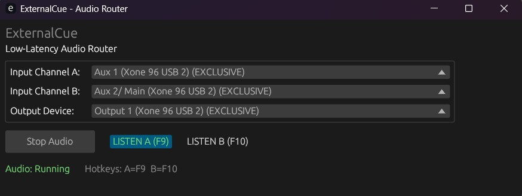

# ⚠️⚠️⚠️ HUGE WARNING: THIS IS AI SLOP. DO NOT USE IN PRODUCTION. ⚠️⚠️⚠️

# ExternalCue — Low-Latency Audio Router (WIP)

ExternalCue is a Windows-focused Rust app to route two live audio inputs (user-selectable) into a single mixed output with very low latency. The project aims to support both WASAPI shared and exclusive modes, a small, responsive UI built with `eframe`/`egui`, and hotkeys for toggling per-channel listening.



Current status
- UI: device selection UI implemented with `eframe`/`egui`. Devices are listed twice (SHARED / EXCLUSIVE) for selection.
- Backend: WASAPI exclusive and shared-mode paths are implemented with event-driven buffering and per-channel mixing.
- Hotkeys: local (focused) hotkeys are implemented (F9/F10 by default).

Remaining work (high-level)
- MIDI hotkeys and global hotkeys are not implemented yet.
- Improve audio diagnostics, underrun logging, and allow user-configurable hotkeys.
- (Optional) Add per-channel VU meters and persistent settings (window size, last devices).

How to build & run
```powershell
cargo build
cargo run
```

